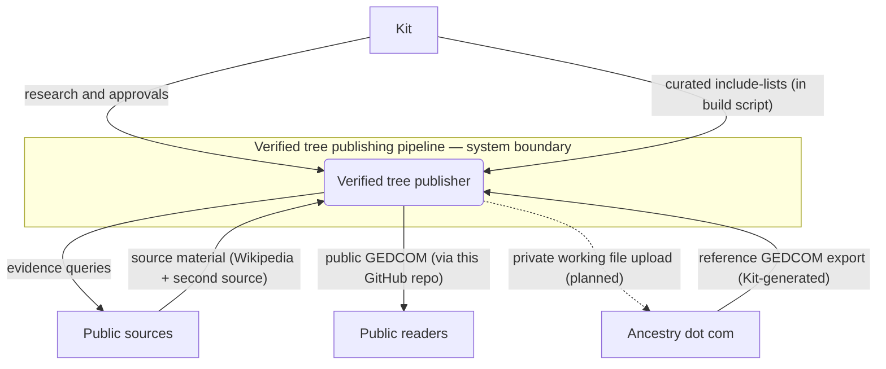
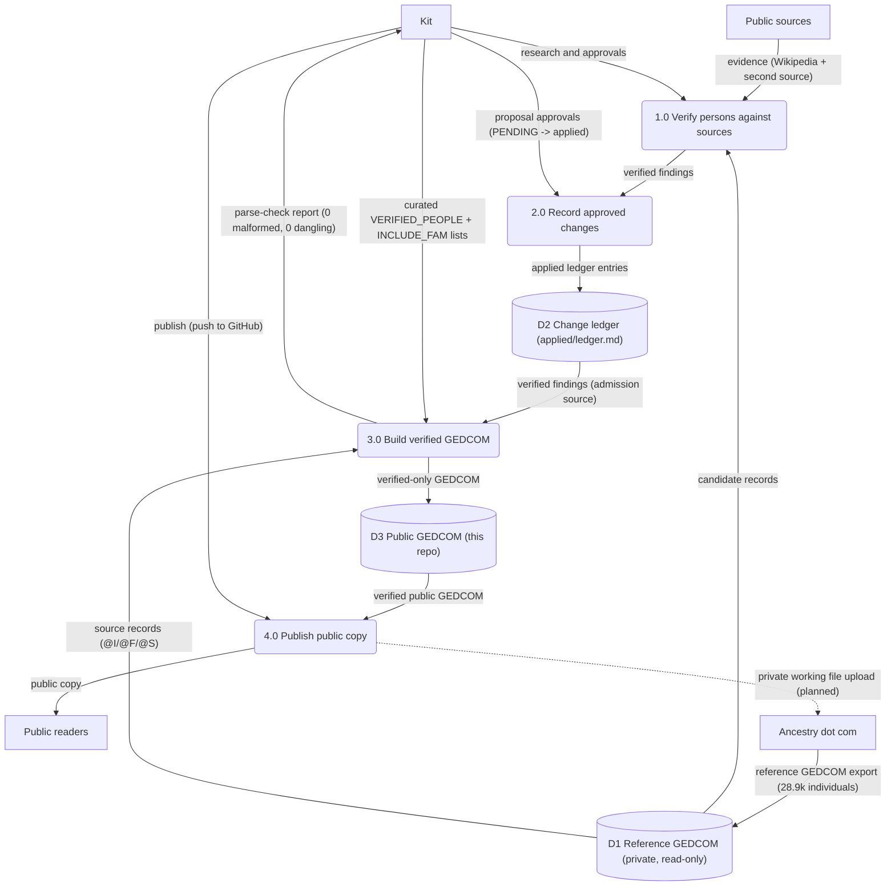
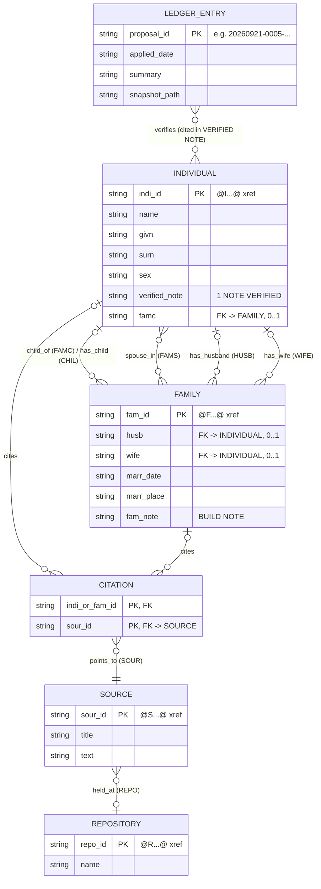

Living document — update these diagrams when adding features.

# genealogy — Architecture

**What this repo is.** This is the **public copy** of Kit's verified-from-scratch family tree build, tree name "1 Timothy 1:4". The private working tree (at `~/workspace/genealogy`, with the proposals, snapshots, analysis, and the living root individual's record) is not published; the private working file is never shared, published, or uploaded per the owner's direction. This repo publishes only the verified-only GEDCOM plus the seed builder, the rulebook, and the change ledger. The original GEDCOM was generated by Kit himself on ancestry.com (integrity-checked at export); this repo contains none of that original file — only the verified extract.

**Repo inventory (observed, recursive tree, 10 entries):** `README.md`, `LICENSE`, `1 Timothy 1_4 - verified - public.ged`, `verified/VERIFIED.md`, `verified/build_verified.py`, `applied/ledger.md`, plus `docs/architecture.md`. No tools, proposals, snapshots, or CI in this repo.

**Known bug fixed in this doc.** The previous version of process 4.0 "Publish public copy" consumed D3 (the public GEDCOM) with no output — a black-hole process. It is corrected below: 4.0 takes the verified public GEDCOM and Kit's publish action, and outputs the published copy to public readers via this GitHub repository (no CI observed; publication is Kit pushing the file).

## 1. Context diagram (level 0)

Boundary note: the system boundary is the verified-tree publishing pipeline. The private working tree and its snapshots live outside this repo and outside the boundary's published artifacts; what crosses into this repo is the verified-only GEDCOM, the builder, the rulebook, and the ledger. The dotted flow to Ancestry.com is a stated future intention (`VERIFIED.md`: "the private working file will be uploaded to Ancestry when complete") — no upload mechanism exists in this repo.

## 2. Level-1 data flow diagram

Process inventory check: every process has ≥1 input and ≥1 output — the 4.0 black hole is fixed; 4.0 now outputs the public copy to readers and the planned upload target.

## 3. Entity–relationship diagram

Grounded in the actual public GEDCOM file (GEDCOM 5.5.1, LINEAGE-LINKED) and in `build_verified.py`. Pointer cardinalities follow what the file actually contains.

Reading notes: `CITATION` is the junction entity for the M:N relationship between individuals/families and sources — observed as 24 level-1 `SOUR @...@` pointers on `INDI` and `FAM` records. Family links are admission-gated: only families whose linked members are all verified are included (all members linked in the file are verified; `@F856@` and `@F526@` exclude unverified members named in their `BUILD NOTE`s; `@F857@` is debated). The `LEDGER_ENTRY → INDIVIDUAL` link is by proposal id cited in the `VERIFIED` NOTE prose (N-10 convention), not a structural GEDCOM pointer. `REPOSITORY` holds the single observed `@R` record; only 7 of the 24 sources carry a `REPO` pointer.

## Grounding notes

- OBSERVED (`1 Timothy 1_4 - verified - public.ged`): 1,183 lines, 50,850 bytes; HEAD declares `SOUR Muse verified build`, `GEDC VERS 5.5.1 FORM LINEAGE-LINKED`, `CHAR UTF-8`, `DATE 21 SEP 2026` (build date frozen at 21 Sep even in the current file); 31 `INDI` records, 4 `FAM` records, 24 `SOUR` records, 1 `REPO` record; 24 level-1 `SOUR @...@` pointers on individuals/families; 1 `FAMC`, 6 `FAMS`, 1 `CHIL`, 4 `HUSB`, 4 `WIFE`, 2 `MARR`; 32 `BUILD NOTE` lines; no living-root-individual record present. The admission rule is enforced structurally: links to non-verified persons are dropped and listed in `BUILD NOTE`s (e.g. `@F856@` excludes three unverified children by name).
- OBSERVED (`verified/build_verified.py`): `SRC = ~/workspace/genealogy/tree/1 Timothy 1_4.ged`; curated `VERIFIED_PEOPLE` list of 30 `(id, label, verified-claim)` entries; `INCLUDE_FAM` with 3 families; copies `INDI`/`FAM`/`SOUR`/`REPO` records verbatim, drops `FAMC`/`FAMS` pointers to non-included families and all `OBJE` pointers (noting both in `BUILD NOTE`s), appends `VERIFIED <date>:` and `BUILD NOTE <date>:` notes, writes `OUT = ~/workspace/genealogy/verified/1 Timothy 1_4 - verified.ged`; then re-parses with a structural-pointer check (`HUSB|WIFE|CHIL|FAMC|FAMS|SOUR|OBJE|NOTE|SUBM|REPO` whose value is a bare `@XREF@`) and fails the build on any malformed line or dangling reference.
- OBSERVED (`verified/VERIFIED.md`): Kit's 2026-09-21 order ("stop patching the Ancestry import; build fresh, admitting only what is verified"); the N-21 two-track admission rule (historical track: Wikipedia + second independent source; document track: Kit's explicit approval via PENDING proposal); every admitted person carries a `VERIFIED` NOTE stating exactly what was verified; the seed list (Rollo cluster, Carolingian ring, Kit's indicate-only marks, the withheld living root); the reference file `~/workspace/genealogy/tree/1 Timothy 1_4.ged` is read-only ("never edited again"); the private working file "will be uploaded to Ancestry when complete" — the basis for the dotted planned-upload flow.
- OBSERVED (`applied/ledger.md`): every applied proposal in order with snapshots, ID-level edits, and post-apply parse verification (0 malformed, 0 dangling); the 20260921-1655 entry records the Friedrich-of-Diessen `@F526@` marriage-only family and claims the verified file at "32 individuals / 4 families / 24 sources" — the file itself measures 31 `INDI` / 4 `FAM` / 24 `SOUR` (see open uncertainties).
- OBSERVED (`README.md`): this is the public copy, built only from verified material; the living root individual's record is withheld; the private working file is not published; `build_verified.py` is "the seed builder (public-safe variant)".
- OBSERVED (GitHub repo metadata): created 2026-09-21; default branch `main`.
- INFERRED: external entity "Public readers" — the repo is public but no reader activity was observed. INFERRED: the 4.0 publish mechanism is Kit pushing the file to GitHub — no CI, webhook, or publish script was observed in the repo. INFERRED: `build_verified.py`'s `VERIFIED_PEOPLE`/`INCLUDE_FAM` lists are transcribed from the ledger's verified findings (the script does not read `applied/ledger.md` at runtime).

## Currency

Current as of 2026-09-28. The only commit since 2026-09-28T00:00:00Z is `ec88cb23` ("docs: add SAD architecture doc") — this doc's predecessor. The public GEDCOM's HEAD build date remains `21 SEP 2026`; post-seed additions (Friedrich of Diessen family and others, per the ledger's 20260921-1655 entry) were made by hand following the script's NOTE conventions.

## Open uncertainties

- The repo's `build_verified.py` is stale relative to the public GEDCOM it documents: its `INCLUDE_FAM` lists 3 families but the file contains 4 (`@F526@` added by hand per the ledger), and its `VERIFIED_PEOPLE` list holds 30 entries against the file's 31 individuals. Re-running the script as committed would not reproduce the current public file.
- The ledger claims "32 individuals" while the file parses to 31 `INDI` records — one count includes something the other doesn't (possibly the `SUBM` record); unverified which side is right.
- `VERIFIED.md` says the reference file has 28,899 individuals; the ledger's pre/post-apply counts imply 28,909 → 28,906. One digit differs; the current reference count is unobserved from this repo.
- The mechanism by which the local private build (`~/workspace/genealogy/verified/1 Timothy 1_4 - verified.ged`) becomes the repo's `1 Timothy 1_4 - verified - public.ged` (rename + living-root withholding step) is described in prose but not scripted in this repo.
