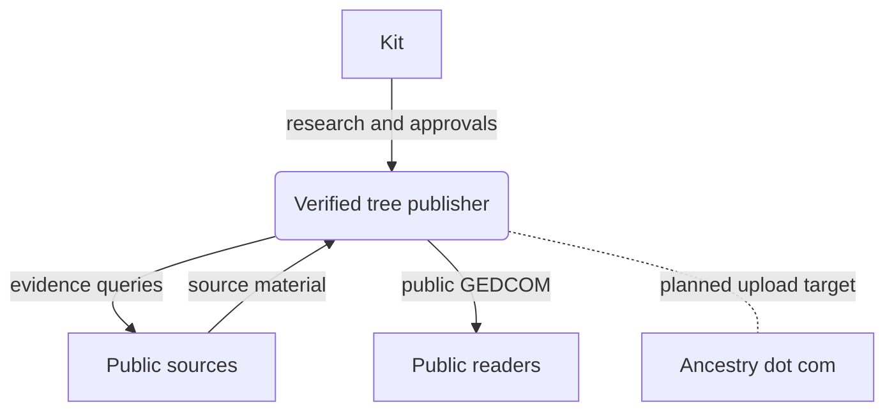
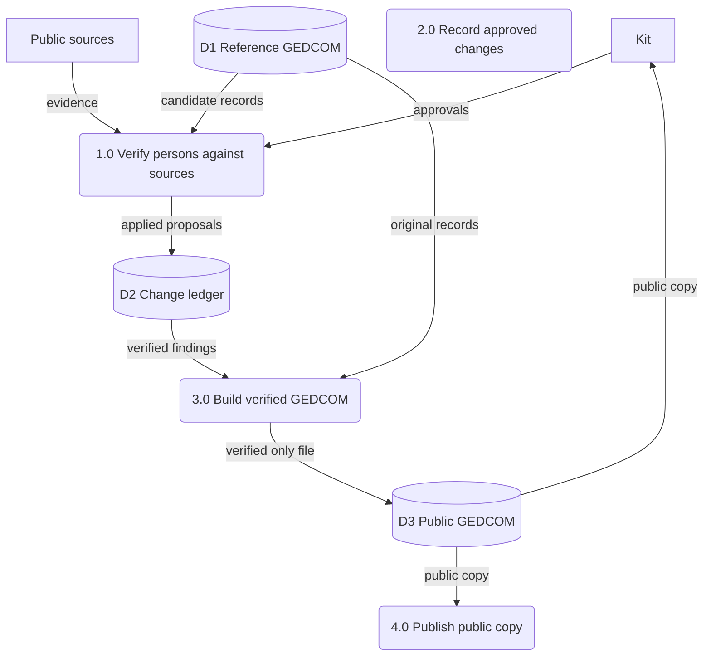
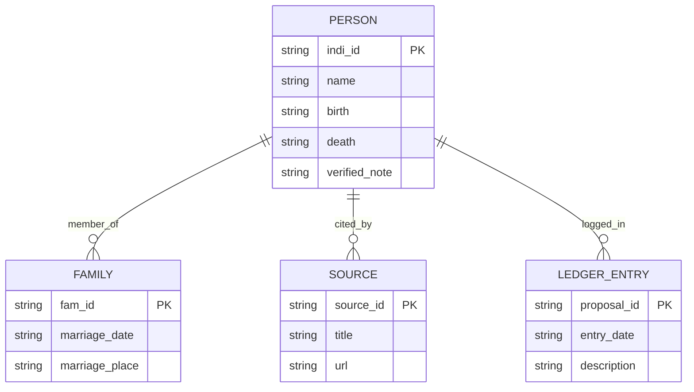

Living document — update these diagrams when adding features.

# genealogy — Architecture

## 1. Context diagram (level 0)

## 2. Level-1 data flow diagram

## 3. Entity–relationship diagram

## Grounding notes

- OBSERVED: 8 files — `README.md`, `LICENSE`, `1 Timothy 1_4 - verified - public.ged`, `verified/VERIFIED.md`, `verified/build_verified.py`, `applied/ledger.md`.
- OBSERVED: README states this is the public copy built only from verified material; the living root individual's record is withheld; the private working file is not published.
- OBSERVED: `VERIFIED.md` gives the admission rule — historical track needs Wikipedia plus a second independent source; document track needs Kit's explicit approval via a PENDING proposal; every admitted person carries a VERIFIED NOTE stating exactly what was verified; no dangling references.
- OBSERVED: `applied/ledger.md` records every applied proposal in order with snapshots and ID-level edits; `build_verified.py` builds the verified-only GEDCOM from the ledger, keeping original `@I`, `@F`, `@S` IDs.
- OBSERVED: `VERIFIED.md` says the private working file will be uploaded to Ancestry when complete — shown as a planned target, not a live integration.
- INFERRED: external entity "Public readers" — the repo is public, but no reader activity was observed.
- INFERRED: the dotted flow to Ancestry dot com is a future intention only; no upload mechanism is present in the repo.
